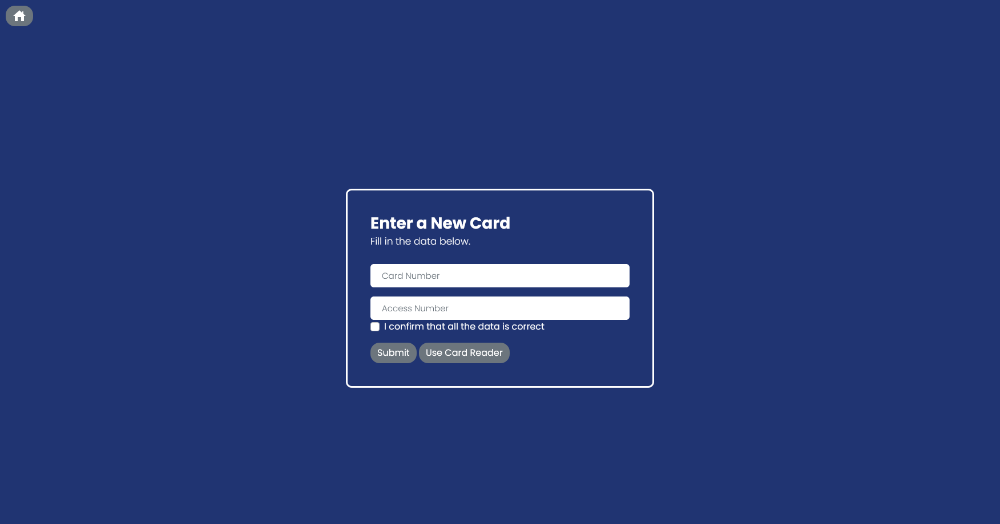
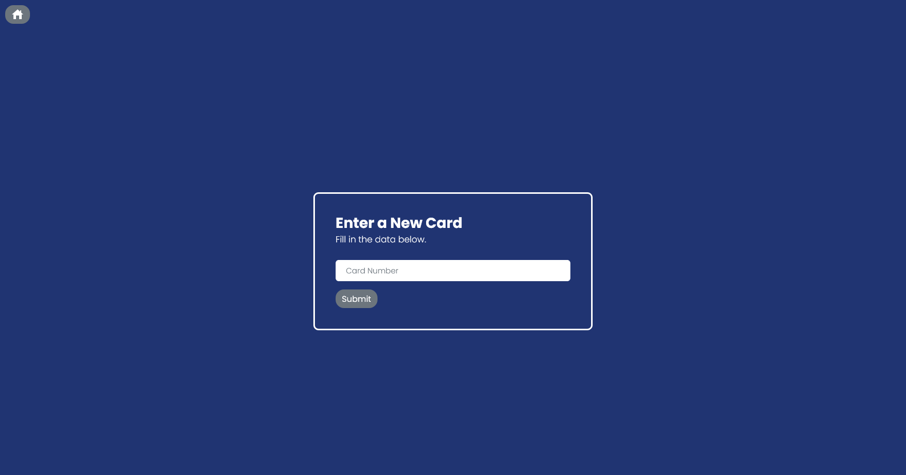

# Card App
  Presentation of App

## Home

## Enter a new temporary ID card into the db

## Use Card reader to collect insert card

## Confirmation Page

## Form to request a new

## Email Reminding user ID is due

## Return Card Form

## View of the cards and who has it
- This view can close the tables by simply clicking the header

