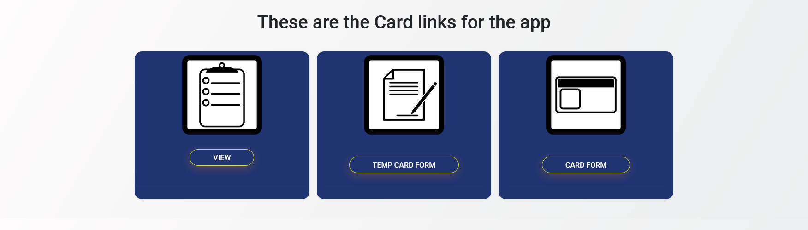

# Card App
- Developed using the CodeIgniter 4 framework; not displayable on Git-pages.

- Developed an application for the Southern Connecticut State University to handle temporary ID cards for residents or students having trouble with their IDs, offering an interim solution until their issues are resolved.
 
# Presentation App

## Home

## Enter a new temporary ID card into the db

## Use Card reader to collect insert card

## Confirmation Page

## Form to request a new

## Email Reminding user ID is due

## Return Card Form

## View of the cards and who has it
- This view can close the tables by simply clicking the header

