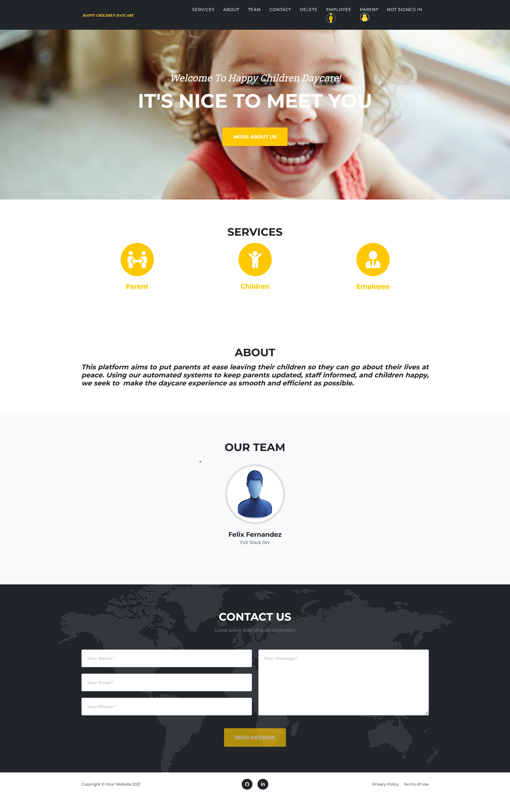

# Happy Children Daycare
- Created with PHP; cannot be displayed on Git-pages

- Developed a website for parents to register, sign in, provide contact details, and enroll their children in daycare while facilitating communication with assigned caretakers. Employees can also register, sign in, and view their work schedules and assigned children's information.

# Presentation of App

## Homepage

## Create Employee account

## Employee account created successfully

## Employee Sign in

## Employee signed in

## Update your information

## Make your working Shifts

## Confirm Shift

## Update your shift

## Employee Status

## Employee and Child Status

## Create Parent account

## Parent account created successfully

## Parent sign in

## Parent signed in

## Update your information

## Add your children

## Child added successfully

## Select your child

## Update your child's information

## Parent status

## Parent Child and Employee status

## Delete account
