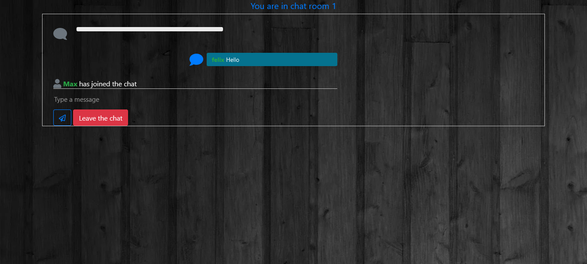
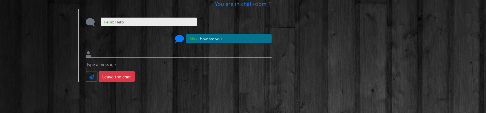
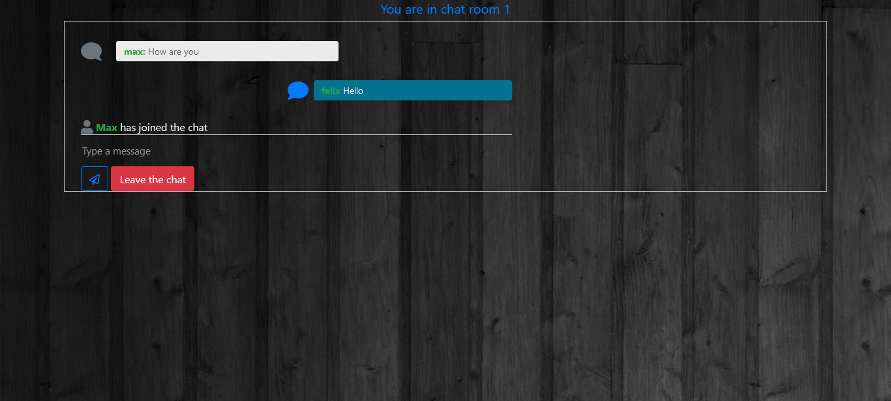

# Python Chat

## Website:

## Create Chat Room

## Enter Room

## Second User

## Second User's room

## Someone joined your room

## Send a message in your room

## Second User receive message

## Second User sends message

## Receive a message in your room

## Second user left the room

