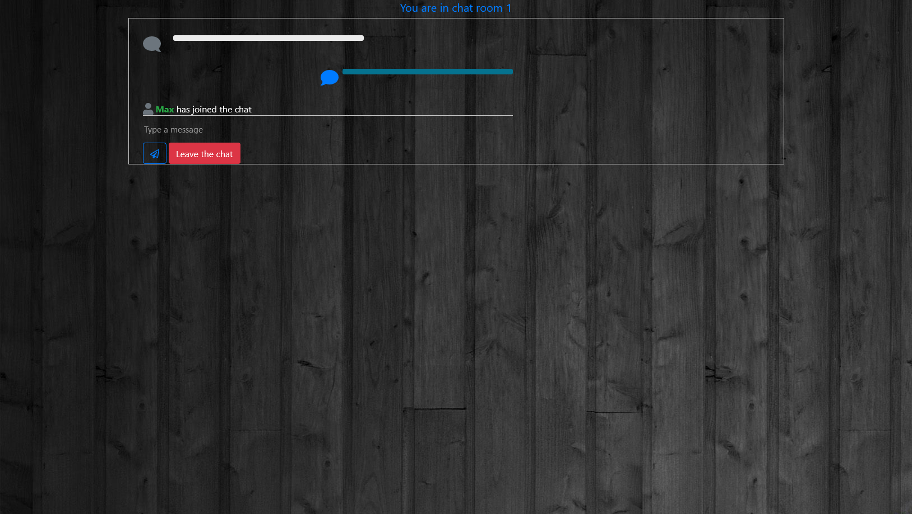
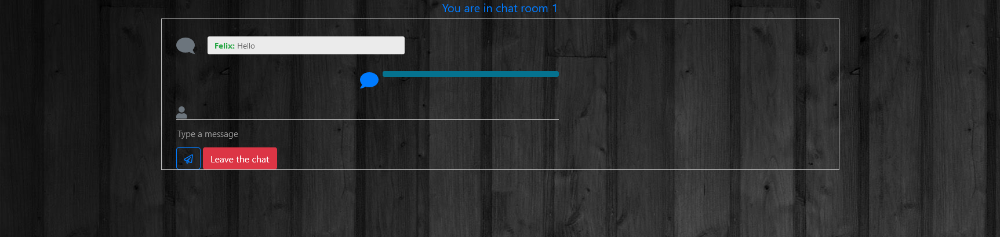

# Air Message
- This was built using python Flask so it can't be showcased on git-pages

- Built a python chat room encrypted end to end where users can make a username to identify and join a room with a room number that identifies the room they then can talk to other users in that room. Instant messaging web application using Flask (Python web development framework), and Socket.io for real time socket package transfers the goal is to not allow packet capture software like WireShark to capture the network packets.

# Presentation of App

## Website:

## Create Chat Room

## Enter Room

## Second User

## Second User's room

## Someone joined your room

## Send a message in your room

## Second User receive message

## Second User sends message

## Receive a message in your room

## Second user left the room

