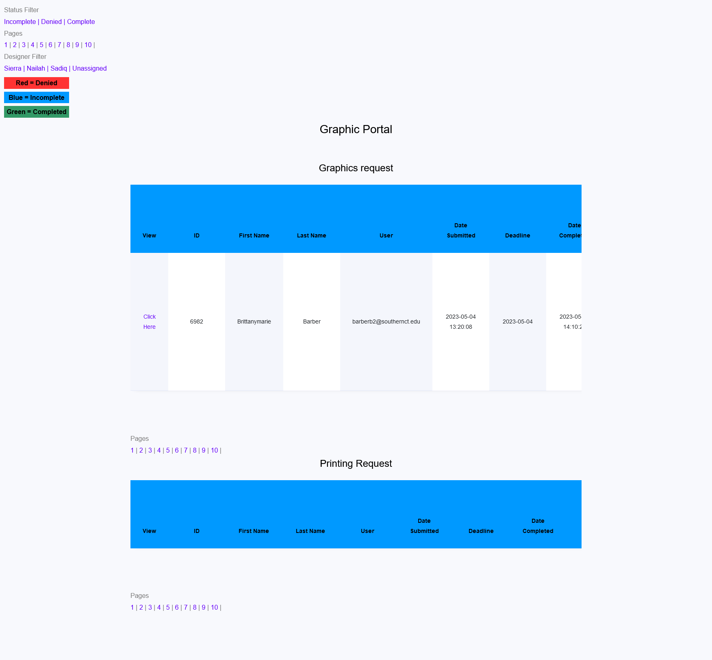
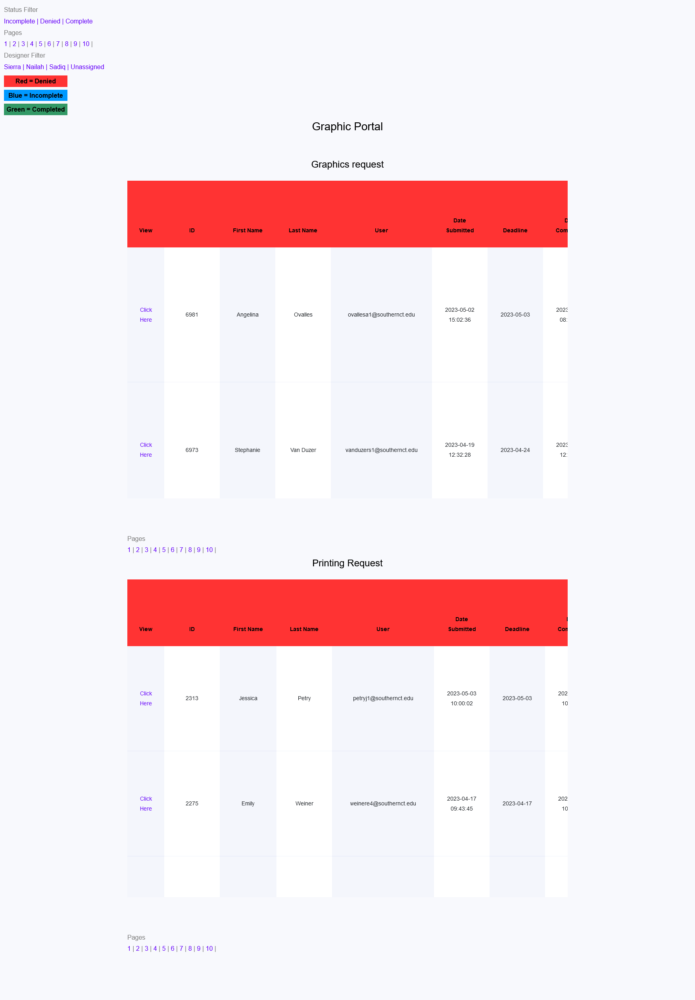
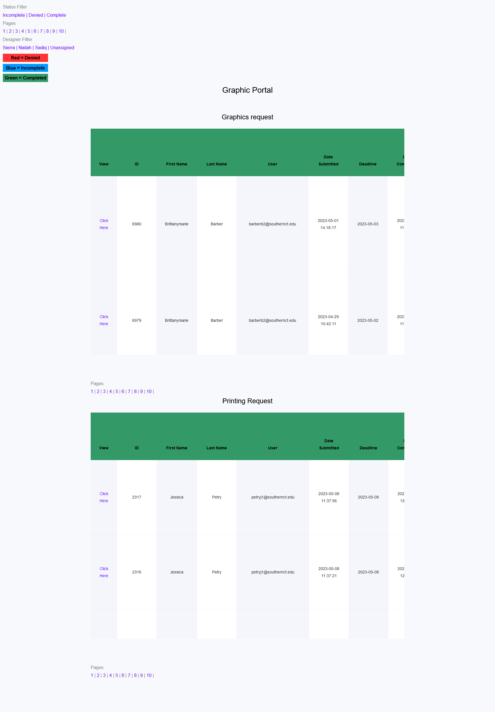

# Graphics Portal

- Built using CodeIgniter 4, PHP, JavaScript, HTML, and CSS.

- Developed an application for Southern Connecticut State University's graphic designers. This app manages and maintains request lists, operating similarly to a ticket system.

## Presentation of App

- All data being showcased is test data it is not real data

## Homepage/Incomplete

## Denied

## Complete

